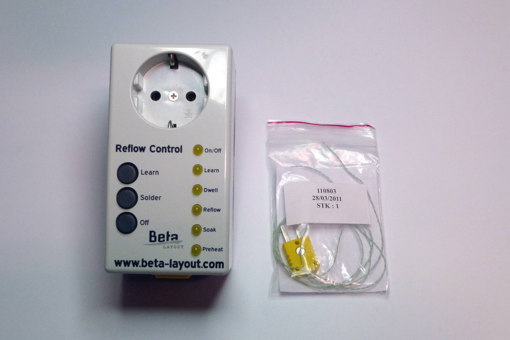
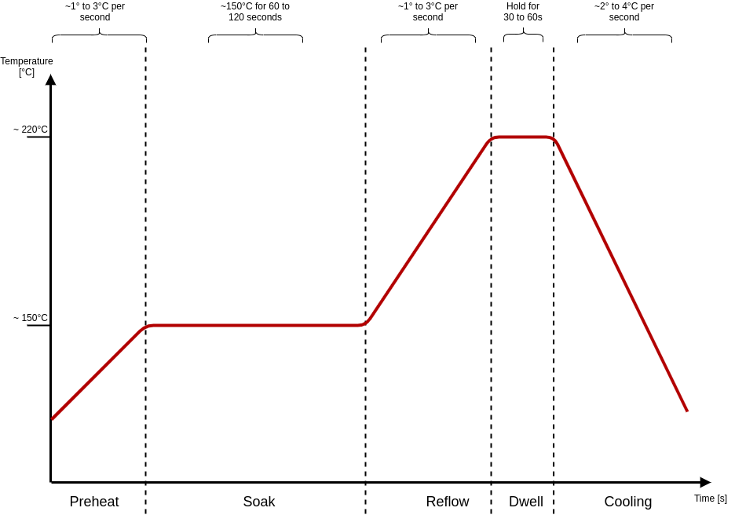

[[section-introduction-and-goals]]
== Introduction and Goals
The reflow controller by Beta layout controlls a convection oven to solder a PCB board with SMT part on it. Unfortunately the controller 
has only a command line interface via serial port. 

The following image shows a typical reflow diagram with its five phases:

* Preheat
* Soak
* Reflow
* Dwell
* Cooling

The ReflowController application offers the possebility to configure and to visualize such a reflow process via a graphical user interface.

{empty} + 

=== Requirements Overview

The main purpose of ReflowController application is the easy use of the Beta-Layout reflow controller.

*Main feature*

* Visualizing of the reflow process
* Easy process configuration
* Load and save of a finished process
* Process analysis

{empty} + 

=== Quality Goals
The quality goals are based on ISO/IEC 25010 definitions
The following table shows the main quality goals of the ReflowController application.

.Quality Goals
[cols=",2,3" options="header"]

|===
| **Priority** | **Quality-Goal** | **Scenario**
|1|Reliability | The application works reliable under normal conditions
|2|Usability: Visibility| The user interface is show all states of a reflow process
|3|Maintainability: | The application is modular and good test able
|4|Usability: UI aesthetics| The UI is attractive and easy to use to perform a reflow process 
|===

{empty} + 

=== Stakeholders
The following lists contains the most important personas for this application

.Stakeholder
[options="header",cols="1,3"]
|===
|Role/Name|Goal/Boundaries
| Software Architects | who wants to know a littlebot more about architectur and documentation 
| Developers | Developers who want to learn about developing modern C++ applications with Qt 
| Hardware Makers | Using the ReflowController application to reflow PCB hardware in the convection oven
|===
