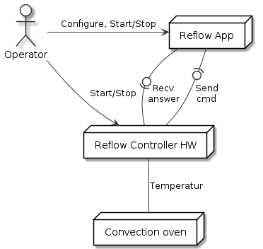

[[section-system-scope-and-context]]
== System Scope and Context
This chapter describes the environment and context of ReflowController: Who uses the system and on which other system does ReflowController depend

=== Business Context

[role="arc42help"]
****
.Contents
Specification of *all* communication partners (users, IT-systems, ...) with explanations of domain specific inputs and outputs or interfaces.
Optionally you can add domain specific formats or communication protocols.

.Motivation
All stakeholders should understand which data are exchanged with the environment of the system.

.Form
All kinds of diagrams that show the system as a black box and specify the domain interfaces to communication partners.

Alternatively (or additionally) you can use a table.
The title of the table is the name of your system, the three columns contain the name of the communication partner, the inputs, and the outputs.
****

**<Diagram or Table>**

**<optionally: Explanation of external domain interfaces>**

=== Technical Context

[role="arc42help"]
****
.Contents
Technical interfaces (channels and transmission media) linking your system to its environment. In addition a mapping of domain specific input/output to the channels, i.e. an explanation with I/O uses which channel.

.Motivation
Many stakeholders make architectural decision based on the technical interfaces between the system and its context. Especially infrastructure or hardware designers decide these technical interfaces.

.Form
E.g. UML deployment diagram describing channels to neighboring systems,
together with a mapping table showing the relationships between channels and input/output.

****

**<Diagram or Table>**

**<optionally: Explanation of technical interfaces>**

**<Mapping Input/Output to Channels>**
